# Cecille's N'Style Boutique Management System

Implemented-only revision draft prepared in the format of the source template.

## Chapter 1. Introduction

### 1.1 The Organization

Cecille's N'Style is a small boutique retail business located in Davao City. The business focuses on apparel and related store merchandise for walk-in retail shoppers. Daily operations are managed directly by the owner and store personnel, who oversee selling activities, product encoding, stock monitoring, supplier coordination, employee profile management, and operational reporting. Because the business handles frequent in-store transactions and recurring stock movement, it benefits from a centralized information system that can connect store activity, purchasing, and managerial reporting in one environment.

### 1.2 Organization Brief Description

The boutique operates as a retail store with a practical need for reliable point-of-sale processing, accurate inventory records, clear supplier coordination, and timely management reporting. Products must be categorized, priced, tagged, monitored for availability, and updated whenever stock enters or leaves the store. Store personnel also need structured account access, role-based permissions, and organized employee records. In addition, the business requires visibility over bale purchasing activity, product movement, sales outcomes, and audit-sensitive actions that affect inventory, pricing, and account access.

The proposed system for the organization is a web-based boutique management system that integrates authentication, user and employee management, product and category management, inventory control, sales and receipt-based returns, supplier records, bale purchasing workflows, reporting, and audit monitoring. The design is intended to reduce fragmented record-keeping and provide a clearer operational picture for daily store management.

### 1.3 Current Business Process

Before adopting an integrated system, the store's operational activities are typically handled through a semi-manual workflow. Product details, selling prices, and stock counts must be tracked across separate records, making updates slow and prone to inconsistency. Inventory increases and decreases must be recorded whenever new stock arrives, items are sold, damaged items are identified, or shrinkage adjustments are made. Because these activities affect stock availability directly, delayed recording can distort the actual quantity on hand.

Supplier coordination and bale purchasing also require organized monitoring. Purchase information, receiving progress, and bale breakdown results must be traced so that the store can understand how newly acquired stock is converted into saleable merchandise. Without an integrated workflow, purchasing records and inventory outcomes are difficult to connect. On the operational side, user access and employee profile records also need consistent handling to ensure that authorized personnel can use the system according to their responsibilities while important actions remain traceable.

Management reporting is another important part of the current business process. The store needs visibility over total sales, low-stock items, bale spending, product movement, supplier performance, and other operating indicators. If this information is compiled manually or scattered across different records, managerial decisions become slower and less precise.

### 1.4 Identified Problems

Based on the implemented scope of the current system and the operational needs of the boutique, the following problems define the motivation for the proposed system:

1. Lack of centralized operational records. User accounts, employee profiles, product information, and supporting documents are difficult to manage consistently without a unified system.
2. Limited inventory traceability. Stock-in, stock-out, damage, shrinkage, and low-stock conditions require a structured process to preserve accurate on-hand balances.
3. Weak transaction visibility. Store sales, payment capture, and receipt-based returns need to be linked to inventory movement and transaction history in real time.
4. Fragmented purchasing oversight. Supplier records, bale purchases, receiving status, and bale breakdown outcomes need a connected workflow to support stock planning and profitability review.
5. Delayed reporting and control. Management requires current sales, purchasing, inventory, and audit information to support operational decisions and accountability.

## Chapter 2. Proposed System

The proposed system is the Cecille's N'Style Boutique Management System, an implemented web-based platform that integrates store operations through a shared application and database environment. The system is organized around nine implemented subsystems: authentication and access control, user and employee management, roles and permissions, product and category management, inventory management, sales and returns, supplier management, purchasing and bale workflow, and reports with audit monitoring.

### 2.1 Use Case Diagram

The use case coverage below follows the implemented module set of the live system. Each subsystem uses actors that reflect the real access model of the application: Administrator, Store Manager, Cashier, Inventory Staff, and Auditor.

#### 2.1.1 Authentication and Access Control

This subsystem controls system entry, session ownership, and credential maintenance. All authorized actors must sign in before using protected modules, and authenticated users can maintain their own password.

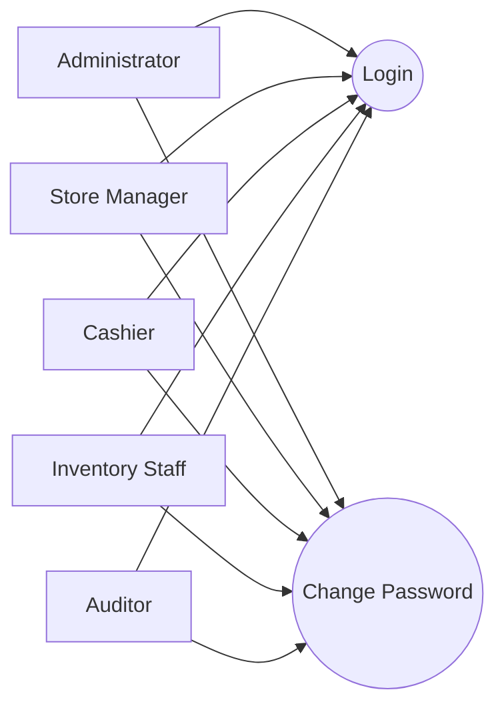

#### 2.1.2 User and Employee Management

This subsystem maintains user accounts, linked employee profile details, and employee document records. The implemented flow combines account administration and employee-profile maintenance instead of separating them into unrelated modules.

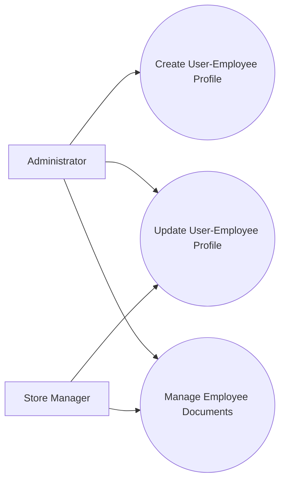

#### 2.1.3 Roles and Permissions

This subsystem governs access rights for the rest of the application. The Administrator manages role definitions and permission assignments so that each actor can access only the functions required by the job.

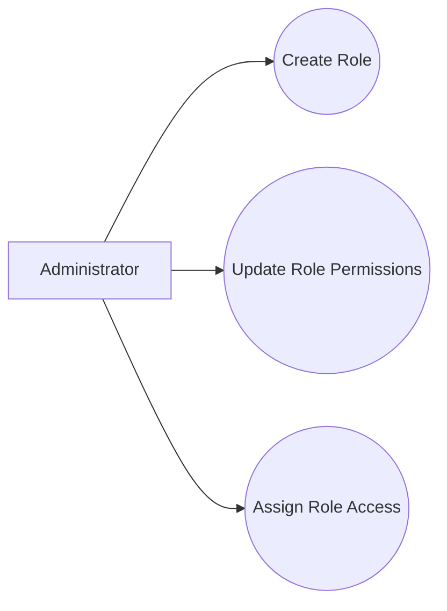

#### 2.1.4 Product and Category Management

This subsystem manages the merchandise catalog used by inventory and sales. It includes category maintenance, product setup, pricing fields, stock thresholds, SKU handling, and barcode or QR-supported identification.

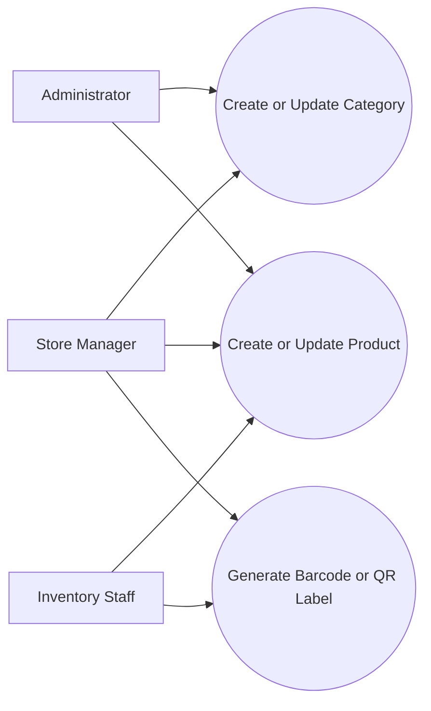

#### 2.1.5 Inventory Management

This subsystem handles stock visibility and stock movement. It supports stock-in, stock-out adjustment, damage recording, shrinkage reporting, low-stock alerts, transaction history, and inventory reporting.

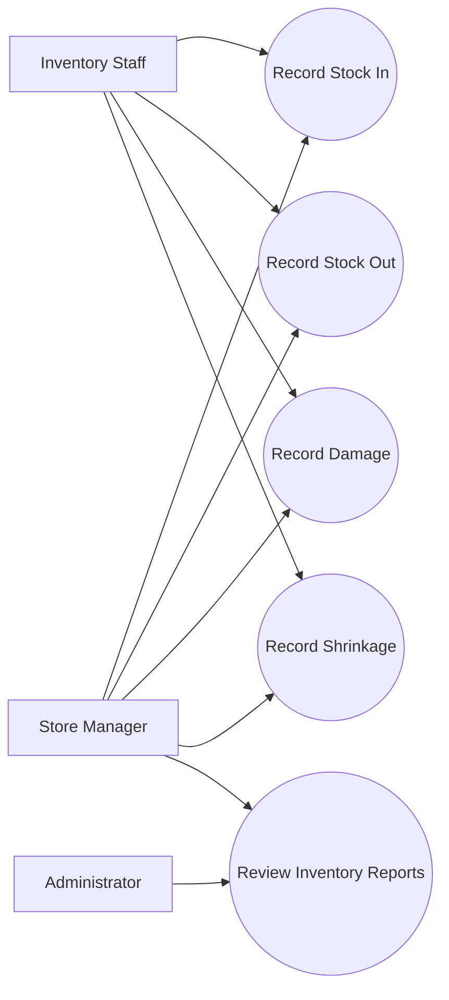

#### 2.1.6 Sales and Returns

This subsystem represents the live point-of-sale workflow. It supports product lookup, draft sale preparation, payment capture, sales history review, transaction logging, and receipt-based returns with inventory disposition rules.

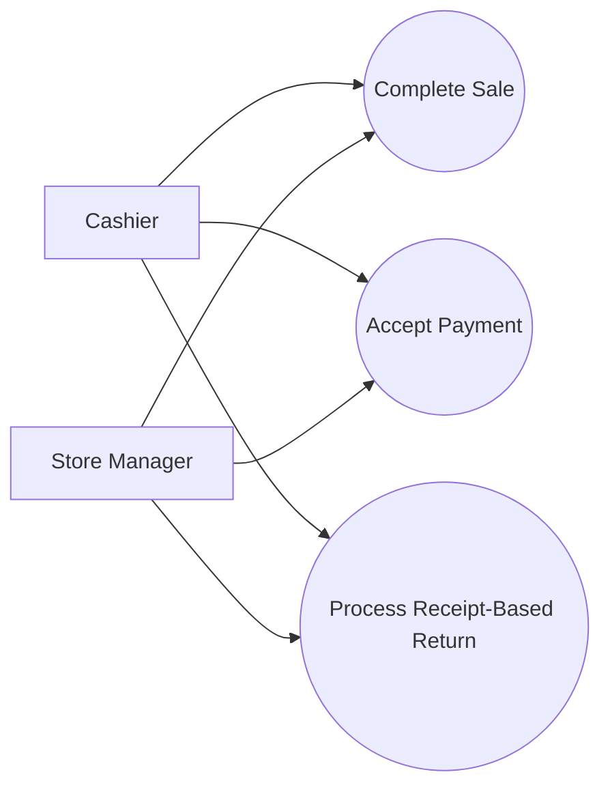

#### 2.1.7 Supplier Management

This subsystem stores supplier records used by purchasing activity. It supports supplier creation, update, viewing, and deletion under authorized access.

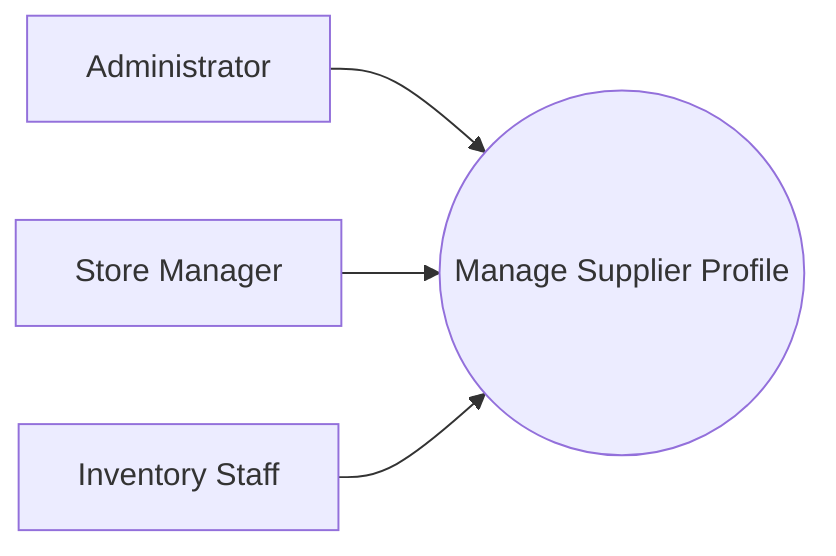

#### 2.1.8 Purchasing and Bale Workflow

This subsystem manages bale purchase records, purchase-order style fields, receiving status, quantity tracking, and bale breakdown results. It links supplier activity to inventory inflow and later reporting.

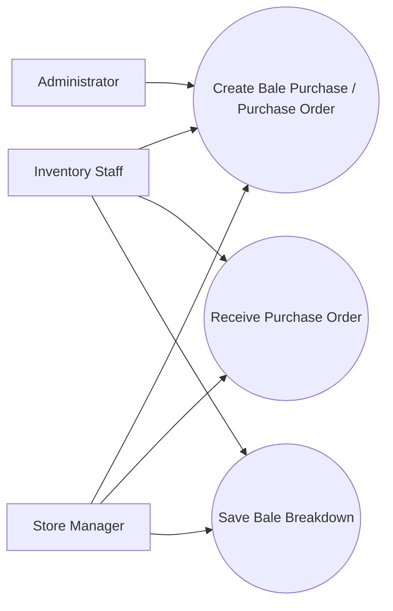

#### 2.1.9 Reports and Audit Monitoring

This subsystem supports managerial review through dashboard summaries, automated bale-aware reporting, CSV export, and audit-log inspection. It provides operational insight while preserving traceability for sensitive actions.

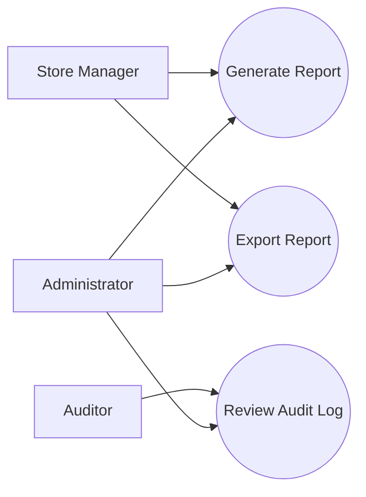

### 2.2 Domain Class Diagram

The implemented domain model is centered on access control, inventory-aware sales, supplier and bale purchasing, employee document tracking, and auditability. The diagram below is limited to the active primary modules so that the paper remains consistent with the live application.

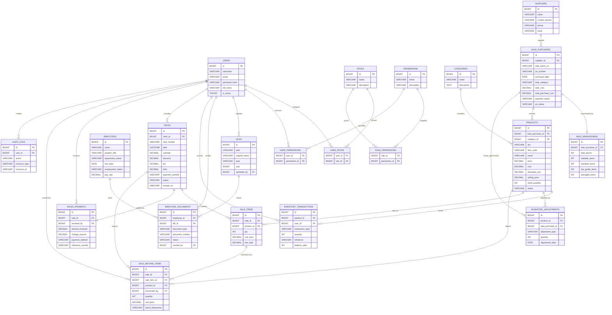

Note: In the live application, user-account records and employee-profile data are managed together in the users module. The operational relationship is application-managed even when a direct one-to-one database link depends on deployment-specific schema support.

### 2.3 Design Class Diagram

To reflect the implemented architecture more accurately, the design class view is presented in three slices rather than one oversized diagram.

#### A. Access and Staff Records

This slice covers authentication, account administration, employee profile maintenance, employee document handling, and audit-visible account actions.

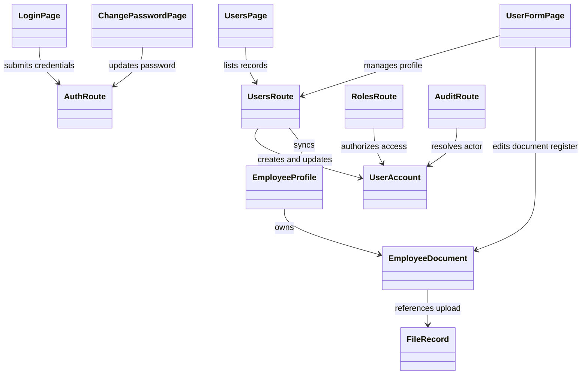

#### B. Catalog, Inventory, and Sales

This slice covers the merchandise catalog, stock movement, barcode or QR-supported lookup, POS checkout, payment capture, and returns.

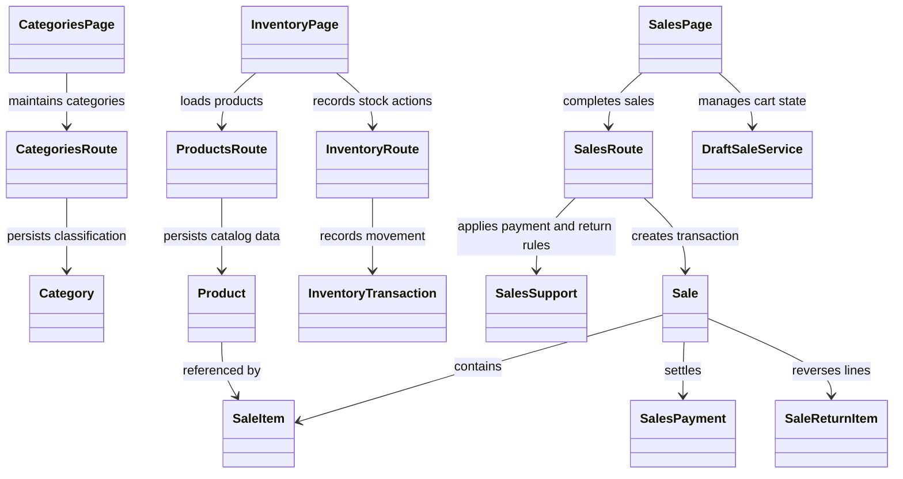

#### C. Suppliers, Purchasing, Reporting, and Audit

This slice covers supplier records, bale purchasing, bale receiving and breakdown, automated reporting, dashboard visibility, and audit review.

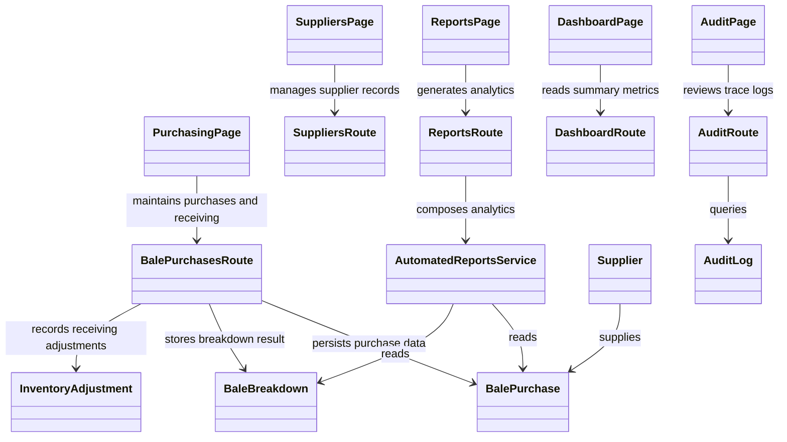

### 2.4 User Interface

This section documents the actual live screens and tab groups available in the current application. Figure placeholders are used so that screenshots can be inserted later without inventing interface content that is not yet captured in the manuscript.

#### 2.4.1 Dashboard

The dashboard provides a store-wide summary of current activity. It presents total sales, today's sales, active products, low-stock items, monthly bale counts, bale spending, recent sales, and top products. This screen serves as the initial operational overview for authenticated users.

*Figure 2.4.1. Dashboard screen showing sales, product, bale, and recent activity summary cards. Insert actual dashboard screenshot here.*

#### 2.4.2 Catalog Setup: Categories and Suppliers

The Categories screen supports merchandise classification for product organization. The Suppliers screen manages supplier profiles used by the purchasing and bale workflow. These screens establish the supporting reference data required by inventory and purchasing modules.

*Figure 2.4.2. Category maintenance screen for merchandise classification. Insert actual categories screenshot here.*

*Figure 2.4.3. Supplier management screen for supplier records used by purchasing. Insert actual suppliers screenshot here.*

#### 2.4.3 Inventory Screen and Tabs

The Inventory screen is a tabbed workspace that contains Overview, Stock In, Stock Out, Products, Barcode Labels, Transactions, Damaged, Low Stock Alerts, Shrinkage, and Reports. This arrangement allows the store to encode products, monitor quantities, record stock movement, print labels, and review stock-related exceptions from one module.

*Figure 2.4.4. Inventory overview tab summarizing product and stock conditions. Insert actual overview screenshot here.*

*Figure 2.4.5. Inventory stock-in and stock-out tabs for quantity adjustments. Insert actual stock movement screenshots here.*

*Figure 2.4.6. Inventory barcode-labels tab used for barcode export and QR label generation. Insert actual label-management screenshot here.*

#### 2.4.4 Sales Screen and Tabs

The Sales screen is also tabbed and includes POS, Accept Payment, Sales, Transactions, Returns, and Sales Report. The module supports product lookup, cart preparation, payment capture, sale history review, transaction review, and receipt-based returns. This is the central front-of-store transaction module.

*Figure 2.4.7. POS tab showing product lookup and sale composition. Insert actual POS screenshot here.*

*Figure 2.4.8. Payment and returns tabs showing payment capture and receipt-driven return handling. Insert actual payment and returns screenshots here.*

#### 2.4.5 Purchasing Screen and Tabs

The Purchasing screen contains Bale Purchases and Bale Breakdown tabs. It is used to encode bale purchases, maintain purchase-order related fields, review receiving progress, and save breakdown totals that classify the contents of each bale.

*Figure 2.4.9. Bale purchases tab for purchase-order style encoding and receiving status. Insert actual bale purchases screenshot here.*

*Figure 2.4.10. Bale breakdown tab for recording total pieces, saleable items, and damaged items. Insert actual bale breakdown screenshot here.*

#### 2.4.6 Reports Screen and Tabs

The Reports screen presents bale-aware analytics through the Bale Purchases, Bale Breakdown, Sales by Bale, Bale Profitability, Supplier Performance, and Inventory Movement tabs. This screen supports management review and CSV export for automated reporting.

*Figure 2.4.11. Reports screen showing tabbed analytics for bale purchases and profitability. Insert actual reports screenshot here.*

#### 2.4.7 Users and Roles

The Users screen lists account records and summary employee details. The User Form screen handles the starter profile and the government-document register for each employee profile. The Roles screen maintains role definitions and permission groupings. Together, these screens manage access control and staff record maintenance.

*Figure 2.4.12. Users screen showing account records with linked employee information. Insert actual users screenshot here.*

*Figure 2.4.13. User form screen showing profile and documents steps. Insert actual user form screenshot here.*

*Figure 2.4.14. Roles screen showing permission-group management. Insert actual roles screenshot here.*

#### 2.4.8 Audit Trail and Change Password

The Audit screen provides searchable activity review with module, action, severity, and summary statistics. The Change Password screen allows authenticated users to maintain their credentials. These interfaces support accountability and account security.

*Figure 2.4.15. Audit screen showing activity filters and summary cards. Insert actual audit screenshot here.*

*Figure 2.4.16. Change Password screen for credential maintenance. Insert actual change-password screenshot here.*

## Appendix A. Events Table

| Event | Trigger | Source use case | Response | Destination |
| --- | --- | --- | --- | --- |
| User logged in | Valid credentials submitted | Login / Change Password | Token is issued and access context is loaded | Auth session |
| Password changed | Authenticated user submits old and new password | Login / Change Password | Password hash is updated and audit event is stored | User account |
| User-employee profile created | New account or employee profile submitted | Create or Update User-Employee Profile | User record and employee profile data are saved | Users and employee records |
| Employee document saved | Document metadata or file submitted | Create or Update User-Employee Profile | Document row and file reference are stored or updated | Employee documents |
| Role definition updated | Role form submitted | Assign or Update Role Permissions | Role and permission mappings are saved | Roles and permissions |
| Category saved | Category form submitted | Create or Update Product / Category | Category record is created or updated | Categories |
| Product saved | Product form submitted | Create or Update Product / Category | Product record is created or updated | Products |
| Barcode or QR label exported | Label export action requested | Generate Barcode or QR Label | Label asset or export file is generated | Inventory label output |
| Stock-in recorded | Stock-in form submitted | Record Stock-In | Product quantity increases and transaction row is stored | Inventory transactions |
| Stock-out, damage, or shrinkage recorded | Stock-out action submitted | Record Stock-Out, Damage, or Shrinkage | Product quantity decreases and transaction row is stored | Inventory transactions |
| Sale completed | POS checkout finalized | Complete Sale and Accept Payment | Sale, sale items, and payment data are stored | Sales records |
| Sale return processed | Receipt-based return submitted | Process Sale Return | Return rows are stored and inventory is adjusted by disposition | Sales return and inventory records |
| Supplier profile saved | Supplier form submitted | Manage Supplier | Supplier record is created or updated | Suppliers |
| Bale purchase saved | Purchasing form submitted | Create Bale Purchase / Purchase Order | Bale purchase or purchase-order style record is stored | Bale purchases |
| Purchase order received | Receiving action confirmed | Receive Purchase Order and Save Bale Breakdown | Receiving quantity and related adjustments are updated | Bale purchases and inventory adjustments |
| Bale breakdown saved | Breakdown form submitted | Receive Purchase Order and Save Bale Breakdown | Breakdown totals are stored for the selected bale | Bale breakdowns |
| Report generated | Report request submitted | Generate or Export Report | Operational analytics payload is created | Reports |
| Report exported | Export request submitted | Generate or Export Report | CSV file is prepared for download | Report export output |
| Audit data retrieved | Audit screen query submitted | Review Audit Log | Filtered audit rows and summary metrics are returned | Audit log review |

## Appendix B. Fully Developed Use Case Description

The fully developed use cases below follow the implemented module set of the current system. Closely related actions are grouped together only when they are handled by the same live module.

### 1. Login / Change Password

**Use case name.** Login / Change Password

**Scenario triggering event.** An authorized user needs to access the system or maintain account credentials.

**Brief description.** Allows an authorized user to sign in to the system and, when already authenticated, update the account password.

**Actors.** Administrator, Store Manager, Cashier, Inventory Staff, Auditor

**Related use cases.** Review Audit Log

**Preconditions.** The user account exists and is active. For password change, the actor is already authenticated and knows the current password.

**Postconditions.** A valid session is created for login, or the stored password is replaced during password change. An audit entry is written for the action.

**Flow of events.**

1. The actor opens the login screen or the change-password screen.
2. The actor enters the required credential values.
3. The system validates the submitted data.
4. For login, the system verifies the account and password, then issues an authenticated session.
5. For password change, the system verifies the current password and stores the new password hash.
6. The system displays success feedback and returns the actor to the authorized workflow.

**Exception condition.**

- If the username or password is invalid, the system rejects login and displays an error.
- If the account is inactive, the system blocks access.
- If the current password does not match during password change, the update is rejected.

### 2. Create or Update User-Employee Profile

**Use case name.** Create or Update User-Employee Profile

**Scenario triggering event.** An administrator or manager needs to add a new staff record or revise an existing account and employee profile.

**Brief description.** Allows an authorized actor to create or update a user account together with employee profile details and supporting statutory document records.

**Actors.** Administrator, Store Manager

**Related use cases.** Assign or Update Role Permissions

**Preconditions.** The actor is authenticated and has permission to manage users. For update, the target record already exists.

**Postconditions.** The user and employee profile information is stored, and any submitted document metadata or file references are saved in the employee document register.

**Flow of events.**

1. The actor opens the Users screen and chooses to create a new record or edit an existing one.
2. The system displays the starter profile fields and the document step when applicable.
3. The actor enters or updates account details, role assignment, employee information, and document metadata.
4. The actor submits the profile.
5. The system validates the required fields and any uploaded files.
6. The system saves the user record, synchronizes the employee profile data, and updates the document register if documents were changed.
7. The system displays success feedback.

**Exception condition.**

- If required profile information is missing, the system rejects the submission.
- If a document file is invalid or exceeds the allowed size, the system rejects the file.
- If the target record cannot be found during update, the system displays an error.

### 3. Assign or Update Role Permissions

**Use case name.** Assign or Update Role Permissions

**Scenario triggering event.** The administrator needs to create a role, revise permission grants, or adjust who can access a subsystem.

**Brief description.** Allows an authorized actor to create role records and update permission assignments that govern access to the rest of the system.

**Actors.** Administrator

**Related use cases.** Login / Change Password

**Preconditions.** The actor is authenticated and has role-management privileges.

**Postconditions.** The role definition and its permission mapping are stored. Access behavior for affected users is updated according to the assigned permissions.

**Flow of events.**

1. The actor opens the Roles screen.
2. The system displays the existing roles and permission catalog.
3. The actor creates a new role or selects an existing role to edit.
4. The actor chooses the required permission set.
5. The actor submits the changes.
6. The system validates the role data and stores the new mapping.
7. The system displays success feedback.

**Exception condition.**

- If the role data is incomplete, the system rejects the update.
- If the actor lacks the necessary permission, access is denied.
- If a role record no longer exists, the system displays an error.

### 4. Create or Update Product / Category

**Use case name.** Create or Update Product / Category

**Scenario triggering event.** The store needs to add a new merchandise category or encode or revise a product record.

**Brief description.** Allows an authorized actor to maintain the product catalog and category structure used by inventory and sales.

**Actors.** Administrator, Store Manager, Inventory Staff

**Related use cases.** Generate Barcode or QR Label; Record Stock-In

**Preconditions.** The actor is authenticated and has catalog-management access.

**Postconditions.** The category or product record is stored with updated merchandise information, pricing fields, identifiers, and stock settings.

**Flow of events.**

1. The actor opens the Categories or Inventory Products interface.
2. The system displays the current category or product records.
3. The actor chooses to create a new record or edit an existing one.
4. The actor enters the necessary data such as category name, product name, price, cost, threshold, and identifying details.
5. The actor submits the form.
6. The system validates the data and stores the category or product record.
7. The system displays success feedback.

**Exception condition.**

- If required product information is missing, the system rejects the submission.
- If the product identifier conflicts with an existing value, the system returns an error.
- If the selected record no longer exists during update, the system displays an error.

### 5. Generate Barcode or QR Label

**Use case name.** Generate Barcode or QR Label

**Scenario triggering event.** The store needs printable or exportable labels for encoded products.

**Brief description.** Allows an authorized actor to prepare barcode or QR label output for one or more products in the inventory module.

**Actors.** Store Manager, Inventory Staff

**Related use cases.** Create or Update Product / Category

**Preconditions.** Product records already exist and the actor has access to the inventory label tools.

**Postconditions.** The requested label output is prepared for preview, CSV export, or QR PDF export.

**Flow of events.**

1. The actor opens the Barcode Labels tab in the Inventory screen.
2. The system loads product records that can be selected for label preparation.
3. The actor selects one or more products and chooses the desired label action.
4. The system generates the barcode or QR content using the stored product identifiers.
5. The system prepares the output for export or print-oriented use.
6. The system displays success feedback.

**Exception condition.**

- If no products are selected, the system blocks the export request.
- If label generation fails, the system displays an error and no output file is produced.

### 6. Record Stock-In

**Use case name.** Record Stock-In

**Scenario triggering event.** New stock is received and the current product quantity must be increased.

**Brief description.** Allows an authorized actor to increase on-hand stock for a specific product and store the corresponding inventory transaction.

**Actors.** Store Manager, Inventory Staff

**Related use cases.** Create or Update Product / Category

**Preconditions.** The actor is authenticated, has inventory-receive access, and the target product exists.

**Postconditions.** The product stock quantity increases and a stock-in transaction row is saved.

**Flow of events.**

1. The actor opens the Stock In tab.
2. The system displays the stock-in form and available products.
3. The actor selects the product and enters quantity and related reference data.
4. The actor submits the stock-in record.
5. The system validates the quantity and locks the product record for update.
6. The system increases the stock quantity and writes the inventory transaction.
7. The system displays success feedback.

**Exception condition.**

- If the product does not exist, the system rejects the request.
- If the quantity is missing or not positive, the system rejects the submission.

### 7. Record Stock-Out, Damage, or Shrinkage

**Use case name.** Record Stock-Out, Damage, or Shrinkage

**Scenario triggering event.** Stock must be decreased because of controlled adjustment, damaged merchandise, or shrinkage.

**Brief description.** Allows an authorized actor to reduce stock for a product while preserving the reason and resulting balance in the transaction record.

**Actors.** Store Manager, Inventory Staff

**Related use cases.** Record Stock-In; Review Audit Log

**Preconditions.** The actor is authenticated, has inventory-adjust access, the product exists, and sufficient stock is available.

**Postconditions.** The product quantity decreases and an inventory transaction is stored with the appropriate reason classification.

**Flow of events.**

1. The actor opens the Stock Out tools in the Inventory module.
2. The system displays adjustment options for shrinkage or damage.
3. The actor selects the product, enters the quantity, and specifies the reason or disposition.
4. The actor submits the stock-out action.
5. The system validates the available stock and the submitted quantity.
6. The system decreases the product balance and stores the corresponding transaction row.
7. The system displays success feedback.

**Exception condition.**

- If available stock is insufficient, the system blocks the operation.
- If the quantity is invalid, the system rejects the request.
- If the product is not found, the system displays an error.

### 8. Complete Sale and Accept Payment

**Use case name.** Complete Sale and Accept Payment

**Scenario triggering event.** A cashier or manager needs to finalize a store transaction in the POS module.

**Brief description.** Allows an authorized actor to create a sale from selected products, capture payment details, generate a receipt number, and store the completed sale.

**Actors.** Cashier, Store Manager

**Related use cases.** Process Sale Return; Generate or Export Report

**Preconditions.** The actor is authenticated and has sales-create access. Products exist and sufficient stock is available for the requested quantities.

**Postconditions.** The sale, sale items, and payment records are stored, inventory is adjusted, and a receipt is generated for the completed transaction.

**Flow of events.**

1. The actor opens the POS tab.
2. The system loads product data and current sales settings.
3. The actor selects products or scans product codes, adjusts quantities, and reviews totals.
4. The actor proceeds to payment and enters payment information.
5. The actor submits the completed sale.
6. The system validates stock, stores the sale and sale items, records the payment, updates inventory, and generates the receipt details.
7. The system displays success feedback and the completed sale output.

**Exception condition.**

- If a requested product is out of stock, the sale cannot be completed.
- If payment details are incomplete or invalid, the system rejects checkout.
- If the actor lacks discount or price-override permission, those actions are blocked.

### 9. Process Sale Return

**Use case name.** Process Sale Return

**Scenario triggering event.** A previously completed sale needs to be returned using the receipt-based returns workflow.

**Brief description.** Allows an authorized actor to look up a completed sale by receipt, choose return quantities, specify a disposition, and store the return transaction.

**Actors.** Cashier, Store Manager

**Related use cases.** Complete Sale and Accept Payment

**Preconditions.** The actor is authenticated and has sales-refund access. The referenced receipt exists and the selected sale item quantities are eligible for return.

**Postconditions.** Return rows are stored, inventory is updated according to the chosen disposition, and return activity becomes visible in reporting and transaction history.

**Flow of events.**

1. The actor opens the Returns tab.
2. The system prompts for the receipt number or receipt lookup.
3. The actor retrieves the target sale and specifies the lines and quantities to return.
4. The actor selects the return disposition and submits the return.
5. The system validates the receipt, quantities, and disposition.
6. The system stores the return record and updates inventory accordingly.
7. The system displays success feedback.

**Exception condition.**

- If the receipt cannot be found, the system rejects the return lookup.
- If the requested return quantity exceeds the recorded sale quantity, the system blocks the submission.
- If the actor lacks return permission, access is denied.

### 10. Manage Supplier

**Use case name.** Manage Supplier

**Scenario triggering event.** Supplier records need to be created, updated, reviewed, or removed.

**Brief description.** Allows an authorized actor to maintain supplier profiles used by purchasing operations.

**Actors.** Administrator, Store Manager, Inventory Staff

**Related use cases.** Create Bale Purchase / Purchase Order

**Preconditions.** The actor is authenticated and has supplier-management access.

**Postconditions.** The supplier record is added, revised, or removed according to the selected action.

**Flow of events.**

1. The actor opens the Suppliers screen.
2. The system displays the current supplier records.
3. The actor selects the desired action: create, edit, or delete.
4. The actor enters or confirms the supplier information.
5. The actor submits the action.
6. The system validates the request and stores the result.
7. The system displays success feedback.

**Exception condition.**

- If required supplier data is missing, the system rejects the create or update request.
- If the target supplier no longer exists, the system displays an error.

### 11. Create Bale Purchase / Purchase Order

**Use case name.** Create Bale Purchase / Purchase Order

**Scenario triggering event.** The store needs to record an incoming bale acquisition or purchase-order style buying activity.

**Brief description.** Allows an authorized actor to create a bale purchase record with supplier, batch, date, cost, payment status, and purchase-order related fields.

**Actors.** Administrator, Store Manager, Inventory Staff

**Related use cases.** Manage Supplier; Receive Purchase Order and Save Bale Breakdown

**Preconditions.** The actor is authenticated and has purchasing access. The supplier exists or has already been encoded.

**Postconditions.** A bale purchase record is stored and becomes available for receiving, breakdown, reporting, and dashboard summary calculations.

**Flow of events.**

1. The actor opens the Bale Purchases tab.
2. The system displays the purchase form and available suppliers.
3. The actor enters the bale batch number, supplier, purchase date, cost, and purchase-order related details.
4. The actor submits the form.
5. The system validates the required inputs and uniqueness of the batch number.
6. The system stores the bale purchase record.
7. The system displays success feedback.

**Exception condition.**

- If the batch number already exists, the system rejects the submission.
- If the supplier reference is invalid, the system displays an error.
- If required purchasing data is missing, the system blocks the save action.

### 12. Receive Purchase Order and Save Bale Breakdown

**Use case name.** Receive Purchase Order and Save Bale Breakdown

**Scenario triggering event.** A stored bale purchase is received and must be reflected in inventory and classified through a bale breakdown.

**Brief description.** Allows an authorized actor to confirm receiving details, update ordered and received quantities, and store the breakdown of saleable and damaged pieces for the bale.

**Actors.** Store Manager, Inventory Staff

**Related use cases.** Create Bale Purchase / Purchase Order; Record Stock-In

**Preconditions.** The actor is authenticated, has purchasing or receiving access, and the referenced bale purchase record exists.

**Postconditions.** The purchase-order status is updated, receiving-related inventory adjustments are saved, and the bale breakdown record is stored for later reporting.

**Flow of events.**

1. The actor selects an existing bale purchase record.
2. The system displays the current purchase-order status and receiving fields.
3. The actor enters receiving information and confirms the action.
4. The actor proceeds to the Bale Breakdown tab and enters the total pieces, saleable items, and damaged items.
5. The actor submits the breakdown.
6. The system validates the receiving data and breakdown totals.
7. The system updates the purchase status, records related adjustments, saves the bale breakdown, and displays success feedback.

**Exception condition.**

- If the selected bale purchase does not exist, the system rejects the operation.
- If the receiving quantities or breakdown totals are invalid, the system blocks the submission.
- If the summed breakdown values exceed the total pieces, the system displays an error.

### 13. Generate or Export Report

**Use case name.** Generate or Export Report

**Scenario triggering event.** Management needs current operational analytics or a downloadable report output.

**Brief description.** Allows an authorized actor to generate bale-aware reports for a selected period and export the report in CSV format when needed.

**Actors.** Administrator, Store Manager

**Related use cases.** Complete Sale and Accept Payment; Create Bale Purchase / Purchase Order

**Preconditions.** The actor is authenticated and has report-view or report-export access.

**Postconditions.** The report payload is generated for on-screen review, or a CSV export file is prepared for download.

**Flow of events.**

1. The actor opens the Reports screen.
2. The system displays the available analytics tabs and date filters.
3. The actor selects a date range and requests report generation.
4. The system composes the report from purchasing, inventory, and sales data.
5. The actor may request CSV export for the generated report.
6. The system prepares the export file and returns it for download.
7. The system displays success feedback or the generated report data.

**Exception condition.**

- If the date input is invalid, the system rejects the request.
- If report generation fails, the system displays an error message.
- If an unsupported export format is requested, the system rejects the export.

### 14. Review Audit Log

**Use case name.** Review Audit Log

**Scenario triggering event.** An administrator or auditor needs to inspect recorded actions and sensitive system events.

**Brief description.** Allows an authorized actor to search, filter, summarize, and inspect audit records generated by operational modules.

**Actors.** Administrator, Auditor

**Related use cases.** Login / Change Password; Record Stock-Out, Damage, or Shrinkage; Complete Sale and Accept Payment

**Preconditions.** The actor is authenticated and has audit-view permission.

**Postconditions.** Filtered audit rows and summary metrics are displayed for review.

**Flow of events.**

1. The actor opens the Audit screen.
2. The system displays summary cards, filters, and recent audit rows.
3. The actor selects filters such as module, action, severity, date, or search terms.
4. The actor submits the query.
5. The system retrieves matching audit rows and enriches them for display.
6. The system shows the filtered audit list and summary statistics.
7. The actor may open a specific audit item for more detail.

**Exception condition.**

- If the actor lacks audit permission, access is denied.
- If the requested audit item cannot be found, the system displays an error.
- If audit retrieval fails, the system returns an error message instead of results.
