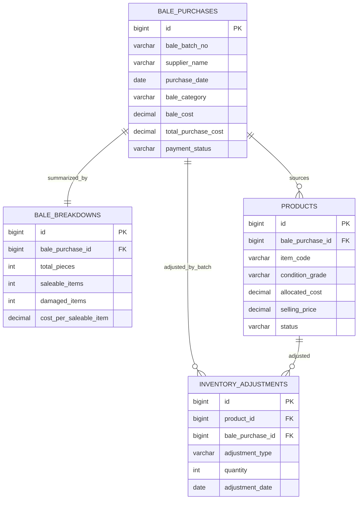

# Revised Manuscript Analysis

## Source Context

- Revised PDF reviewed: `C:\Users\acer\Downloads\Revised_Cecille's Nstyle SIA Manuscript - Ilanga, Palanca, Sintos.pdf`
- Extracted text used for analysis: `C:\Users\acer\SIA\.codex_pdf_tools\revised_manuscript.txt`
- Codebase reviewed against the manuscript: `backend/` and `frontend/`

## What the Revised Manuscript Is Arguing

The manuscript presents Cecille's N' Style Boutique as a small retail clothing business in Davao City that still runs on a semi-manual workflow. The paper identifies five main operational problems:

1. No centralized record system for employees, customers, and products
2. Poor inventory monitoring
3. Manual payroll computation
4. No proper sales and supplier tracking
5. No automated analytics for management decisions

The proposed solution is an integrated boutique management system covering:

- HR
- Payroll
- Inventory
- Sales ordering / management
- Supplier ordering

The manuscript's functional emphasis is practical and operational rather than theoretical. It is mainly trying to show that the system will replace handwritten and paper-based processes with a connected digital workflow.

## How the Current System Relates to the Manuscript

The current project already aligns strongly with the manuscript's core business direction. This is not just an inventory prototype anymore. The actual codebase already contains substantial module coverage in both backend and frontend.

### 1. HR / User Management

The manuscript describes employee profiling, role assignment, and HR views. The current system supports this, but its implementation is slightly different from the paper's wording.

Current implementation:

- Frontend route for users: `frontend/src/App.js`
- Combined create/edit user + employee screen: `frontend/src/pages/UserFormPage.jsx`
- User CRUD: `backend/src/routes/users.js`
- Employee CRUD: `backend/src/routes/employees.js`

Important note:

- In the running app, HR is represented as a combined `User + Employee` flow, not as a completely separate standalone HR subsystem.
- The frontend route for `employees` currently redirects to `users`, which means the actual UX is more consolidated than the manuscript suggests.

## 2. Inventory Management

Inventory is one of the strongest matches between the manuscript and the actual system.

Current implementation already supports:

- Stock-in
- Receive from purchase order
- Stock-out adjustment
- Damage recording
- Supplier returns
- Damaged stock view
- Low stock alerts
- Inventory summary reporting

Relevant files:

- `backend/src/routes/inventory.js`
- `frontend/src/pages/Inventory.js`

This aligns well with the manuscript's event table and use cases for:

- stock-in
- stock-out
- damages
- returns
- low stock alerts
- inventory reports

## 3. Supplier Ordering / Purchasing

The manuscript includes supplier ordering and purchase order flows. The current system already supports those.

Current implementation:

- Purchase order CRUD: `backend/src/routes/purchaseOrders.js`
- Supplier CRUD: `backend/src/routes/suppliers.js`
- Purchasing UI coverage: `frontend/src/pages/Inventory.js` and `frontend/src/pages/Purchasing.jsx`

This is a strong paper-to-system match.

## 4. Sales Management / POS

The manuscript describes cashier-driven ordering, payment recording, receipt printing, and sales reporting. The current system already implements this area in a more detailed way than the paper describes.

Current implementation includes:

- POS product loading
- order drafting
- payment handling
- receipt generation / print flow
- transaction history
- sales reports
- receipt-based returns
- multiple payment method handling

Relevant files:

- `backend/src/routes/sales.js`
- `frontend/src/pages/Sales.jsx`

Important note:

- The manuscript says multiple payment methods should be supported, and the current sales module already supports that direction.
- The system's return handling is more concrete than the manuscript because it uses receipt lookup and inventory reintegration rules such as restock, damage, or shrinkage.

## 5. Reports and Analytics

The manuscript identifies lack of analytics as a key business problem. The current system clearly addresses this.

Current implementation includes:

- dashboard metrics
- sales reporting
- inventory reporting
- automated reports

Relevant files:

- `backend/src/routes/dashboard.js`
- `backend/src/routes/reports.js`
- `frontend/src/pages/Reports.jsx`
- `frontend/src/pages/Dashboard.js`

Important note:

- The current reports module is more advanced and more specialized than the manuscript.
- The existing reports page is bale-aware and includes purchase, profitability, supplier performance, and inventory movement analysis.
- If the paper is revised to match the system, this can be used as a strength, but it also means the paper should describe the actual reporting scope carefully.

## ERD-Oriented Analysis

From an ERD perspective, the current system already has a solid operational backbone, but the real data model is split between:

- the base schema in `backend/src/database/sia.sql`
- runtime-created sales tables in `backend/src/utils/salesSupport.js`
- runtime-created bale/reporting tables in `backend/src/utils/automatedReports.js`

That means the manuscript should not describe the database as if it were only the original static schema. The active system already behaves like a larger integrated ERD.

### Core ERD Snapshot

This is the most useful ERD view for the paper's main business story.

```mermaid
erDiagram
    USERS {
        bigint id PK
        varchar username
        varchar email
        varchar password_hash
        varchar full_name
        boolean is_active
    }

    ROLES {
        bigint id PK
        varchar name
        varchar description
    }

    PERMISSIONS {
        bigint id PK
        varchar name
        varchar description
    }

    USER_ROLES {
        bigint user_id FK
        bigint role_id FK
    }

    USER_PERMISSIONS {
        bigint user_id FK
        bigint permission_id FK
    }

    ROLE_PERMISSIONS {
        bigint role_id FK
        bigint permission_id FK
    }

    EMPLOYEES {
        bigint id PK
        varchar name
        varchar role
        varchar contact
        date hire_date
        decimal pay_rate
        varchar employment_status
    }

    ATTENDANCE {
        bigint id PK
        bigint employee_id FK
        date date
        time clock_in
        time clock_out
        decimal hours_worked
    }

    PAYROLLS {
        bigint id PK
        bigint employee_id FK
        date period_start
        date period_end
        decimal gross_pay
        decimal deductions
        decimal advances
        decimal net_pay
        bigint processed_by FK
        varchar status
    }

    CATEGORIES {
        bigint id PK
        varchar name
    }

    PRODUCTS {
        bigint id PK
        bigint category_id FK
        varchar sku
        varchar name
        decimal price
        decimal cost
        int stock_quantity
        int low_stock_threshold
    }

    INVENTORY_TRANSACTIONS {
        bigint id PK
        bigint product_id FK
        bigint user_id FK
        varchar transaction_type
        int quantity
        varchar reference
        int balance_after
    }

    CUSTOMERS {
        bigint id PK
        varchar name
        varchar phone
        varchar email
    }

    SUPPLIERS {
        bigint id PK
        varchar name
        varchar contact_person
        varchar phone
        varchar email
    }

    PURCHASE_ORDERS {
        bigint id PK
        bigint supplier_id FK
        varchar po_number
        varchar status
        date expected_date
        decimal total
    }

    PURCHASE_ITEMS {
        bigint id PK
        bigint purchase_order_id FK
        bigint product_id FK
        int quantity
        decimal unit_cost
    }

    SALES {
        bigint id PK
        bigint clerk_id FK
        bigint customer_id FK
        varchar sale_number
        datetime date
        decimal subtotal
        decimal discount
        decimal total
        varchar payment_method
        varchar receipt_no
    }

    SALE_ITEMS {
        bigint id PK
        bigint sale_id FK
        bigint product_id FK
        int qty
        decimal unit_price
        decimal line_total
    }

    SALES_PAYMENTS {
        bigint id PK
        bigint sale_id FK
        bigint received_by FK
        decimal amount_received
        decimal change_amount
        varchar payment_method
        varchar reference_number
    }

    SALE_RETURN_ITEMS {
        bigint id PK
        bigint sale_id FK
        bigint sale_item_id FK
        bigint product_id FK
        int quantity
        decimal unit_price
        varchar return_disposition
        bigint processed_by FK
    }

    AUDIT_LOGS {
        bigint id PK
        bigint user_id FK
        varchar action
        varchar resource_type
        varchar resource_id
    }

    SAVED_REPORTS {
        bigint id PK
        bigint owner_id FK
        varchar name
    }

    FILES {
        bigint id PK
        bigint uploaded_by FK
        varchar path
        varchar original_name
    }

    NOTIFICATIONS {
        bigint id PK
        bigint recipient_user_id FK
        varchar type
        varchar status
    }

    USERS ||--o{ USER_ROLES : has
    ROLES ||--o{ USER_ROLES : assigned_to
    USERS ||--o{ USER_PERMISSIONS : has
    PERMISSIONS ||--o{ USER_PERMISSIONS : granted_to
    ROLES ||--o{ ROLE_PERMISSIONS : has
    PERMISSIONS ||--o{ ROLE_PERMISSIONS : mapped_to

    EMPLOYEES ||--o{ ATTENDANCE : logs
    EMPLOYEES ||--o{ PAYROLLS : receives
    USERS ||--o{ PAYROLLS : processes

    CATEGORIES ||--o{ PRODUCTS : classifies
    PRODUCTS ||--o{ INVENTORY_TRANSACTIONS : moves
    USERS ||--o{ INVENTORY_TRANSACTIONS : records

    SUPPLIERS ||--o{ PURCHASE_ORDERS : receives
    PURCHASE_ORDERS ||--o{ PURCHASE_ITEMS : contains
    PRODUCTS ||--o{ PURCHASE_ITEMS : ordered_as

    USERS ||--o{ SALES : encodes
    CUSTOMERS ||--o{ SALES : places
    SALES ||--o{ SALE_ITEMS : contains
    PRODUCTS ||--o{ SALE_ITEMS : sold_as
    SALES ||--|| SALES_PAYMENTS : settles
    USERS ||--o{ SALES_PAYMENTS : receives
    SALES ||--o{ SALE_RETURN_ITEMS : returns
    SALE_ITEMS ||--o{ SALE_RETURN_ITEMS : returned_from
    PRODUCTS ||--o{ SALE_RETURN_ITEMS : affects
    USERS ||--o{ SALE_RETURN_ITEMS : processes

    USERS ||--o{ AUDIT_LOGS : creates
    USERS ||--o{ SAVED_REPORTS : owns
    USERS ||--o{ FILES : uploads
    USERS ||--o{ NOTIFICATIONS : receives
```

### Extended Analytics ERD Snapshot

The current reporting layer also implies a second ERD slice for bale-specific analytics.

### ERD Reading of the Current System

From the database viewpoint, the strongest manuscript-to-system alignment is:

- `Products -> Inventory Transactions -> Sales / Sale Items`
- `Suppliers -> Purchase Orders -> Purchase Items -> Products`
- `Users -> Sales -> Sales Payments / Sale Returns`
- `Employees -> Attendance -> Payrolls`

This means the system is already best understood as a transactional operations system with reporting attached, not just a set of isolated forms.

## Areas Where the Manuscript and Current System Do Not Fully Match

These are the most important mismatches to keep in mind during revision.

### 1. Payroll Is Only Partially Reflected in the Active Application Layer

The manuscript gives payroll major importance. In the codebase:

- payroll and attendance tables exist in `backend/src/database/sia.sql`
- dashboard metrics reference pending payroll in `backend/src/routes/dashboard.js`
- permissions for attendance and payroll exist in seed data

But I did not find a dedicated active payroll route module or a dedicated payroll page wired into the main app router.

Implication for the paper:

- Do not overclaim that payroll is fully implemented in the current system unless there is hidden code not wired into the active app.
- Safer wording is that payroll and attendance are part of the intended integrated architecture, with some database and permission groundwork already present.

### 2. Customer Management Exists in Backend Code but Is Not Fully Wired Into the Main App

The manuscript identifies customer records as part of the centralized system problem.

Current state:

- Customer route logic exists in `backend/src/routes/customers.js`
- Dashboard counts customers in `backend/src/routes/dashboard.js`
- There are customer-related frontend files in `frontend/src/pages/`

But:

- `backend/server.js` does not currently mount `/customers`
- `frontend/src/App.js` does not currently expose a `customers` route

Implication for the paper:

- Customer management exists as a code asset, but it is not currently part of the visible main application flow.
- If the revision must reflect the deployed/current system, this should be described carefully.

### 3. HR Structure in the Paper Is More Separated Than in the Real App

The manuscript presents HR as a distinct module. The real app combines user account management and employee record management in a shared workflow.

Implication:

- For the revision, it is more accurate to describe HR as an integrated user-employee management module rather than two fully separate layers.

### 4. Reporting Scope in the Real System Is More Advanced Than the Paper

The manuscript frames reports mainly as standard business summaries. The current system includes more specialized reporting logic, especially around bale purchases and profitability.

Implication:

- If the paper is meant to document the current system, the reporting discussion should be expanded.
- If the paper is meant to stay close to the original proposal, the current code may be treated as an extended implementation beyond the original minimum scope.

## Manuscript Quality Issues Found

### 1. Numbering / Section Structure Inconsistency

The table of contents lists `4. UI Interface`, but the body later shows:

- `4. Domain Class Diagram`
- `5. UI Interface`

This should be corrected for consistency.

### 2. Some Use Case Wording Is Too Generic

Examples:

- "Create new item record" under sales is vague
- some actor labels switch between `Store Manager`, `Cashier`, `Sales Clerk`, and `Owner`

This is not fatal, but the paper will read more professionally if actor names and action labels are standardized.

### 3. The Paper Mostly Describes the Proposed System at a Conceptual Level

That is acceptable for a manuscript, but if this revision is supposed to reflect the actual built system, the paper now needs tighter language that distinguishes:

- currently implemented functionality
- partially implemented functionality
- future or planned functionality

## Recommended Positioning for the Revision

If the goal is to align the paper with the current system, the safest framing is:

1. Present the system as an integrated boutique management platform centered on inventory, sales, supplier purchasing, user/employee management, and reporting.
2. Treat payroll and attendance as part of the broader architecture, but only claim full implementation if the active routes and UI are available.
3. Treat customer management carefully, because backend logic exists but active routing is not fully exposed in the main app.
4. Emphasize that the current implementation already solves the original paper's strongest problem areas:
   - inventory tracking
   - sales recording
   - supplier purchase tracking
   - reporting and analytics
   - centralized user and employee records

## ERD Suggestions for the Revision

If you want the paper's ERD or database discussion to match the current system better, these are the strongest suggestions.

### 1. Make `employees` and `users` a clear one-to-one relationship

Right now the application logic treats users and employees as linked records, but the base schema does not make that relationship explicit.

Suggested change:

- add `employees.user_id` as the canonical foreign key to `users.id`
- use that as the single authoritative HR-account linkage

Why this helps:

- simplifies the HR story in the manuscript
- reduces ambiguity in CRUD logic
- makes the ERD easier to explain

### 2. Move runtime-created operational tables into the canonical database design

Important live tables are currently created in code, not only in the base SQL schema.

Suggested change:

- include `sales_payments`
- include `sale_return_items`
- include `bale_purchases`
- include `bale_breakdowns`
- include `inventory_adjustments`

Why this helps:

- the ERD in the paper will match the actual running system
- reduces the gap between "documented schema" and "runtime schema"
- makes future maintenance cleaner

### 3. Decide whether `customers` is active or archival

The backend has a `customers` domain, but the app routing does not fully expose it.

Suggested decision:

- either fully wire `customers` into backend and frontend
- or explicitly treat it as retained schema for historical records and future expansion

Why this helps:

- avoids overclaiming in the manuscript
- makes the ERD more honest

### 4. Normalize payroll support tables if payroll will be emphasized in the paper

The manuscript talks about leaves, deductions, and cash advances. The current schema stores payroll totals, but not all payroll sub-records as separate entities.

Suggested additions if payroll is a major thesis point:

- `employee_leaves`
- `cash_advances`
- `payroll_adjustments`
- `payslips`

Why this helps:

- makes payroll auditable
- supports the manuscript's claims about deductions and advances
- gives a stronger ERD for the payroll chapter

### 5. Remove or redefine duplicate inventory representations

The schema has both `damaged_inventory` and broader movement tracking through `inventory_transactions`, plus report-specific `inventory_adjustments`.

Suggested change:

- pick one primary source of truth for damage and adjustment events
- use summary/report tables only when necessary

Why this helps:

- avoids duplicated business meaning
- reduces inconsistent counts across inventory, damaged items, and reports
- makes the ERD simpler

### 6. Strengthen supplier linkage for bale reporting

The bale reporting schema currently uses `supplier_name`, while the operational purchasing schema uses `supplier_id`.

Suggested change:

- add or preserve `bale_purchases.supplier_id`
- keep `supplier_name` only as a denormalized snapshot if needed

Why this helps:

- aligns analytics with operational purchasing
- makes supplier performance reporting more reliable
- improves ERD consistency

### 7. Keep one official ERD scope in the paper

Because the system now has both core boutique operations and bale-specific analytics, the paper should avoid mixing everything into one unreadable diagram.

Recommended presentation:

- ERD 1: Core operational ERD
- ERD 2: Extended analytics / bale reporting ERD

Why this helps:

- easier to defend during presentation
- easier for advisers to read
- clearer mapping between manuscript chapters and actual implementation

## Practical Revision Guidance

When revising the paper, these statements are safe and well-supported by the current system:

- The system centralizes records for users, employees, products, suppliers, sales, and inventory.
- The system automates stock-in, stock-out, damage tracking, returns, and purchase order workflows.
- The system supports POS transactions, payment recording, receipt generation, and sales reporting.
- The system provides dashboard and report views to improve management decision-making.

These statements should be used carefully unless confirmed in the active build:

- Payroll is fully operational end-to-end
- Attendance is fully exposed in the UI
- Customer management is fully integrated in the deployed app
- The static SQL file alone fully represents the complete running ERD

## Bottom Line

The revised manuscript is directionally consistent with the current system, especially in inventory, sales, purchasing, HR-linked user management, and reporting. The strongest revision risk is not conceptual mismatch, but overstatement. The paper currently describes some modules, especially payroll and customer management, more broadly than the active app wiring clearly proves.

For the next task, this should be treated as the working interpretation:

- Strongly implemented: inventory, sales, purchasing, reporting, user/employee management
- Partially evidenced or not fully wired in active app flow: payroll, attendance, customer management
